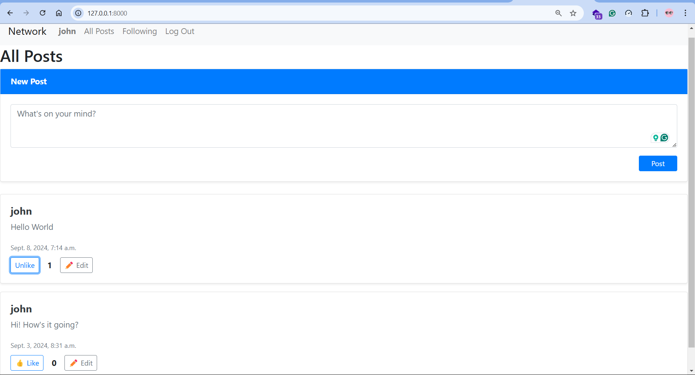
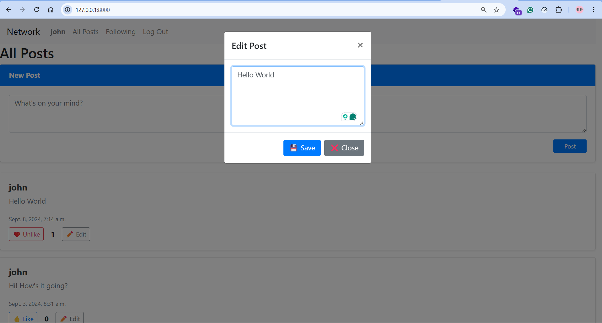
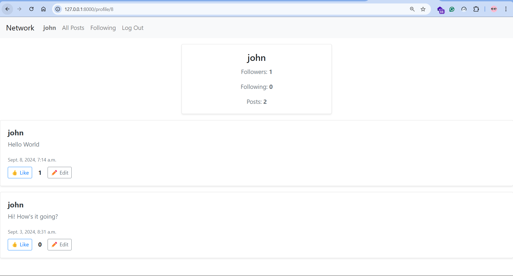

## Network - CS50w Project 4

This project is a Twitter-like social network web application built using Python (Django), JavaScript, HTML, and CSS. It allows users to create accounts, make posts, follow other users, like posts, and edit their own posts.

### Screenshots

### Features
- User Authentication:

    - Users can sign up, log in, and log out.

    - Only authenticated users can create posts, like posts, and follow other users.

- New Post:

    - Authenticated users can create new posts via a text area and submit them.

    - Posts are displayed in reverse chronological order.

- All Posts:

    - Displays all posts from all users.

    - Each post shows the username, content, timestamp, and number of likes.

- Profile Page:

    - Displays a user's profile, including the number of followers and users they follow.

    - Shows all posts by the user in reverse chronological order.

    - Authenticated users can follow/unfollow other users (excluding themselves).

- Following Page:

    - Displays posts only from users that the current user follows.

    - Available only to authenticated users.

- Pagination:

    - Posts are displayed 10 per page.

    - "Next" and "Previous" buttons allow navigation between pages.

- Edit Post:

    - can edit their own posts using a textarea without reloading the page.

    - Ensures security by preventing users from editing others' posts.

- Like/Unlike Posts:

    - Users can like or unlike posts.

    - Like counts are updated asynchronously using JavaScript (fetch API) without reloading the page.

### Admin Interface Credentials

-   username: saw
-   password: saw
